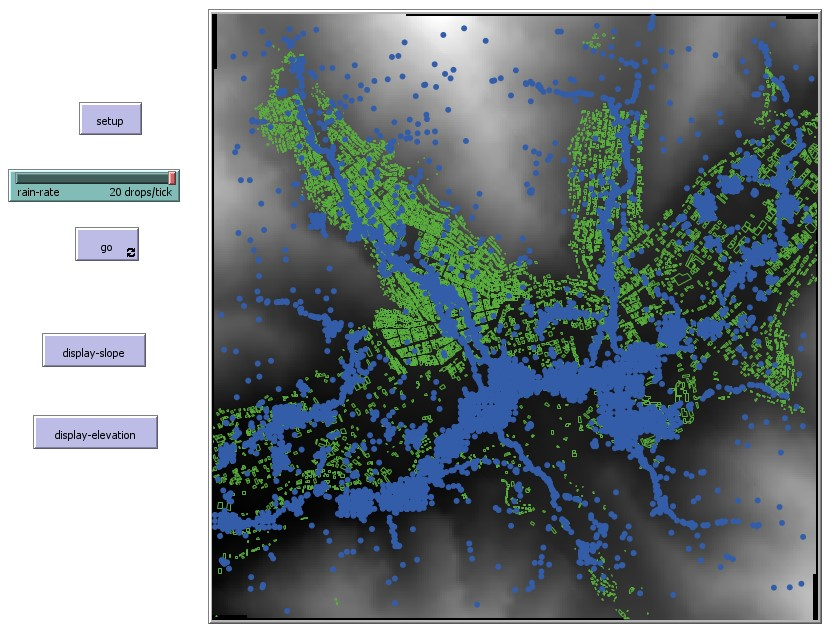
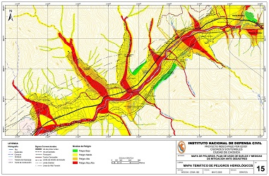

# Chosica flooding water modelling

### WHAT IS IT?

The following model attempts to simulate the flow of water in the region of Chosica, Lima, Peru. This area is known for its high risk of landslides, which are caused by the high rainfall in the area. This usually happens when "El Nino" phenomenon occurs, causing the soil to become unstable and the water to flow through the slopes of the mountains.

  

  

### HOW IT WORKS

The model uses a DEM (Digital Elevation Model) of the area, which is used to calculate the slope and aspect of the terrain by leveraging the covolve matrix. The slope is used to determine the direction of the flow of water, and the aspect is used to determine the direction of the turtle. The turtles are used to simulate the flow of water, and they move in the direction of the slope. The model also uses a shapefile of the buildings in the area, which are used to determine the border of the area. The turtles are killed when they reach the border of the area.

### HOW TO USE IT

Press the SETUP button to load the DEM and the buildings shapefile, and to paint the elevation and slope. Press the GO button to start the simulation. The rain-rate slider controls the number of turtles created per tick.

### THINGS TO NOTICE

There are two parts of the water modelling: the flow of the water when it is in the slope, and the flow of the water when it is in the flat areas. The flow of the water in the slope is controlled by the slope of the terrain, and once the water reaches a flat area, we will move the water to the next non-full patch. This is done by using the "move-to-next-lowest" procedure.

### THINGS TO TRY

Try changing the rain-rate slider to see how the flow of the water changes. Try changing the DEM to see how the flow of the water changes. You can display the slope and elevation by pressing the "display-slope" and "display-elevation" buttons.

### EXTENDING THE MODEL

The model can be extended by improving the flow of the water in the flat areas. Currently, the water is moved to the next non-full patch, but this can be improved by using a breadth-first search algorithm to find the shortest path to the next non-full patch. However, this will require a lot of computational power, due to the runtime complexity of the algorithm. Another way to improve the model is to use a more detailed DEM, which will allow us to simulate the flow of water in the streets of the area.

### CREDITS AND REFERENCES

- QGIS.org, %Y. QGIS Geographic Information System. QGIS Association. http://www.qgis.org

- Wilensky, U. (1999). NetLogo. http://ccl.northwestern.edu/netlogo/. Center for Connected Learning and Computer-Based Modeling, Northwestern University, Evanston, IL.

- Wilensky, U. (2006). NetLogo Grand Canyon model. http://ccl.northwestern.edu/netlogo/models/GrandCanyon. Center for Connected Learning and Computer-Based Modeling, Northwestern University, Evanston, IL.

- Wilensky, U. (2006). GIS Gradient Example. http://ccl.northwestern.edu/netlogo/models/GISGradientExample. Center for Connected Learning and Computer-Based Modeling, Northwestern University, Evanston, IL.

- DIVA-GIS. Download Data by Country. https://www.diva-gis.org/gdata. Accessed 3 Oct. 2023.

- INSTITUTO NACIONAL DE DEFENSA CIVIL (INDECI). (2005) Mapa tematico de peligros hidrologicos de la ciudad de Chosica - Lima. https://sigrid.cenepred.gob.pe/sigridv3/documento/2779
